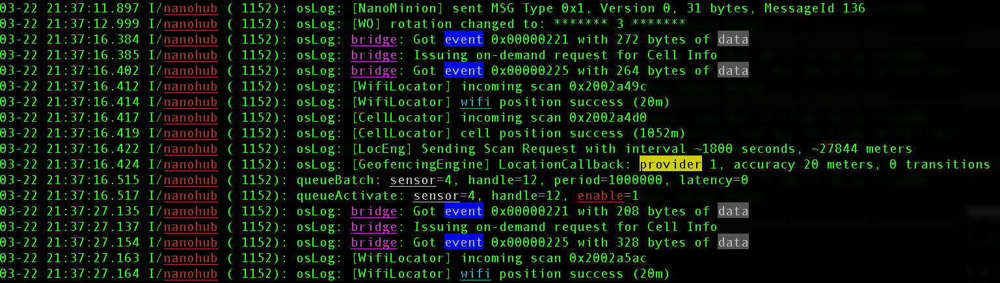
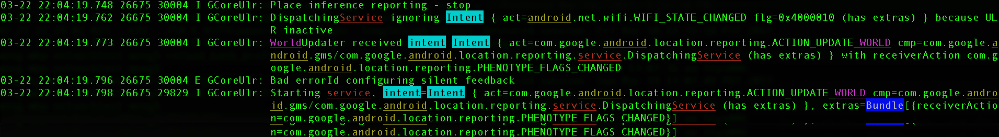

hl (A Simple Text Highlighting Tool)
====================================

This is a simple text highlight tool similar to `grep --color`,
but unlike grep, this tool can highlight with specific different
colors for different keywords, which is very useful for debugging or analyzing logs

You can grep or/and highlight(only) with keywords for a file or a bash pipe

All the key words to grep or highlight should be delimited
with `|` and you can specify its color by following each key word
with `\color_name`. The supported color names are `BLACK, RED, GREEN, YELLOW, BLUE, MAGENTA, CYAN, WHITE,
BG_BLACK, BG_RED, BG_GREEN, BG_YELLOW, BG_BLUE, BG_MAGENTA, BG_CYAN, BG_WHITE`.
Color names are case ignored. Color with prefix "BG_" means background color.

Regular expressions are not supported for now.

Here is an example:
```bash
    hl --grep='nanohub' --hl='enable|bridge\magenta|event\bg_blue|sensor\white|data\bg_black|provider\bg_yellow|wifi\cyan' file.txt
```


Example to use it in bash pipe mode:
```bash
    cat file.txt | hl --grep='nanohub' --hl='enable|bridge\magenta|event\bg_blue|sensor\white|data\bg_black|provider\bg_yellow|wifi\cyan'
```

You can also wrap long lines with a specific width and indent, which makes your logs even more readable when the log has headers
```bash
    hl --wrap-indent=43 --ihl='service|android\cyan|android\yellow|bundle\bg_blue|world\magenta|intent\bg_cyan' file.txt
```


Here are usage details:

<pre>
usage: hl [-h] [--grep WORD_LIST_TO_GREP] [--hl WORD_LIST_TO_HIGHLIGHT]
          [--grepv WORD_LIST_TO_EXCLUDE] [--igrep WORD_LIST_TO_GREP]
          [--ihl WORD_LIST_TO_HIGHLIGHT] [--igrepv WORD_LIST_TO_EXCLUDE]
          [--wrap-indent WRAP_INDENT_WIDTH] [--wrap TERMINAL_WIDTH]
          [--hide-header HIDE_HEADER_REGEX] [--hide-header-ios]
          [--hide-header-android] [-v]
          [files [files ...]]

Highlight keywords in a file or stdin with different specified colors

positional arguments:
  files                 File path

optional arguments:
  -h, --help            show this help message and exit
  --grep WORD_LIST_TO_GREP
                        Filter lines with words in log messages. The words are
                        delimited with '|', where each word can be tailed with
                        a color initialed with '\'. If no color is specified,
                        'RED' will be the default color. For example, option
                        --grep='word1|word2\CYAN' means to filter out all
                        lines containing either 'word1' or 'word2', and
                        'word1' will appear in default color 'RED' while
                        'word2' will be in the specified color 'CYAN'.
                        Supported colors (case ignored): {BLACK, RED, GREEN,
                        YELLOW, BLUE, MAGENTA, CYAN, WHITE, BG_BLACK, BG_RED,
                        BG_GREEN, BG_YELLOW, BG_BLUE, BG_MAGENTA, BG_CYAN,
                        BG_WHITE, NONE}. The color with prefix 'BG_' is
                        background color. And color 'NONE' means NOT
                        highlighting with color. You can have multiple '--
                        grep' options in the command line, and if so, the
                        command will grep all of the key words in all '--grep'
                        options. Escape '|' with '\|', and '\' with '\\'.
  --hl WORD_LIST_TO_HIGHLIGHT
                        Words to highlight in log messages. Unlike --grep
                        option, this option will only highlight the specified
                        words with specified color but does not filter any
                        lines. Except this, the format and supported colors
                        are the same as '--grep'. You can have multiple '--hl'
                        options in the command line, and if so, the command
                        will highlight all of the key words in all '--hl'
                        options
  --grepv WORD_LIST_TO_EXCLUDE
                        Exclude lines with words from log messages. The format
                        and supported colors are the same as '--grep'. Note
                        that if both '--grepv' and '--grep' are provided and
                        they contain the same word, the line will always show,
                        which means '--grep' overwrites '--grepv' for the same
                        word they both contain. You can have multiple '--
                        grepv' options in the command line, and if so, the
                        command will exclude the lines containing any keywords
                        in all '--grepv' options
  --igrep WORD_LIST_TO_GREP
                        The same as '--grep', just ignore case
  --ihl WORD_LIST_TO_HIGHLIGHT
                        The same as '--hl', just ignore case
  --igrepv WORD_LIST_TO_EXCLUDE
                        The same as '--grepv', just ignore case
  --wrap-indent WRAP_INDENT_WIDTH
                        If this option is provided, each wrapped line will be
                        added an extra indent. This option implicitly enables
                        '--wrap' option, however, please NOTE that when
                        running in pipe mode, you have to use '--wrap' option
                        explicitly to specify the terminal width by just
                        adding '--wrap=`tput cols`'. For example, 'cat
                        file.txt | hl.py --grep='test' --wrap=`tput cols`'
  --wrap TERMINAL_WIDTH
                        When running in pipe mode (like 'cat file.txt | hl.py
                        --grep='test' --wrap=`tput cols`'), if you want to
                        wrap each line width specified width, you need to give
                        terminal width as the value, just put `tput cols`
                        here. When this option is provided, every line will be
                        wrapped based on the 'terminal_width' specified, where
                        each line will be limited to the area with this width
  --hide-header HIDE_HEADER_REGEX
                        The parameter is regular expression. When this option
                        provided, the script will match the head of each log
                        line with the regular expression, and remove the
                        matched header in the output. This is useful when the
                        output has big long headers in each line which you
                        don't care and want to hide them from the output. The
                        regular expression syntax is in python style as
                        described in
                        'https://docs.python.org/2/library/re.html'. Note that
                        you can also keep some part of the header in the
                        outputby adding '(' and ')' around the sub regex in
                        your regex string. You can specify multiple '--hide-
                        header' options, and if multiple regex are matched,
                        the longest matched header will be removed from
                        output.
  --hide-header-ios     Built-in option to hide iOS console header. The same
                        as "--hide-header='[A-Za-z]{3}[\s]+[0-9]+[\s]+[0-9:]{8
                        }[\s]+[^\s]+[\s]+[^\s]+\[[0-9]+\][\s]+<[^\s]+>:[\s]+'"
  --hide-header-android
                        Built-in option to hide Android 'adb logcat' output
                        header. The same as "--hide-header='^[0-9-]+[\s]+[0-9:
                        .]+\s*[0-9]+\s*[0-9]+[\s]+[A-Z][\s]+.+?:[\s]+' --hide-
                        header='^[0-9-]+[\s]+[0-9:.]+[\s]+[A-Z]/.+?\(
                        *\d+\):[\s+]' --hide-header='[A-Z]/.+?\(
                        *\d+\):[\s]+'"
  -v, --version         Print the version number and exit
</pre>

Install
-------

Get the script:

 * Download the `hl.py`
 * Place it on your PATH
